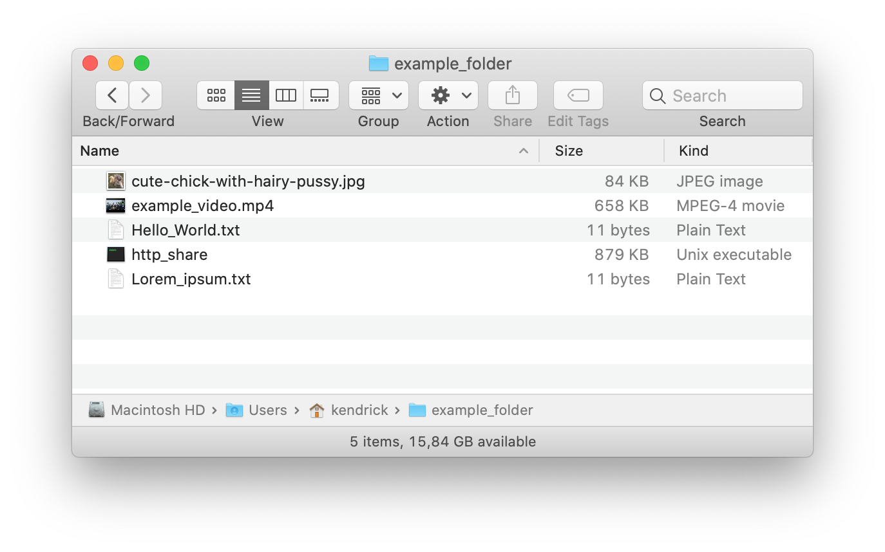
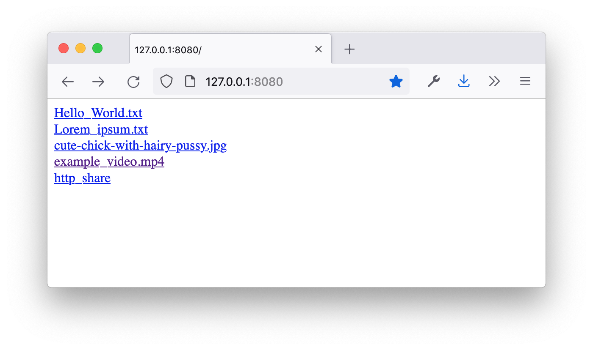
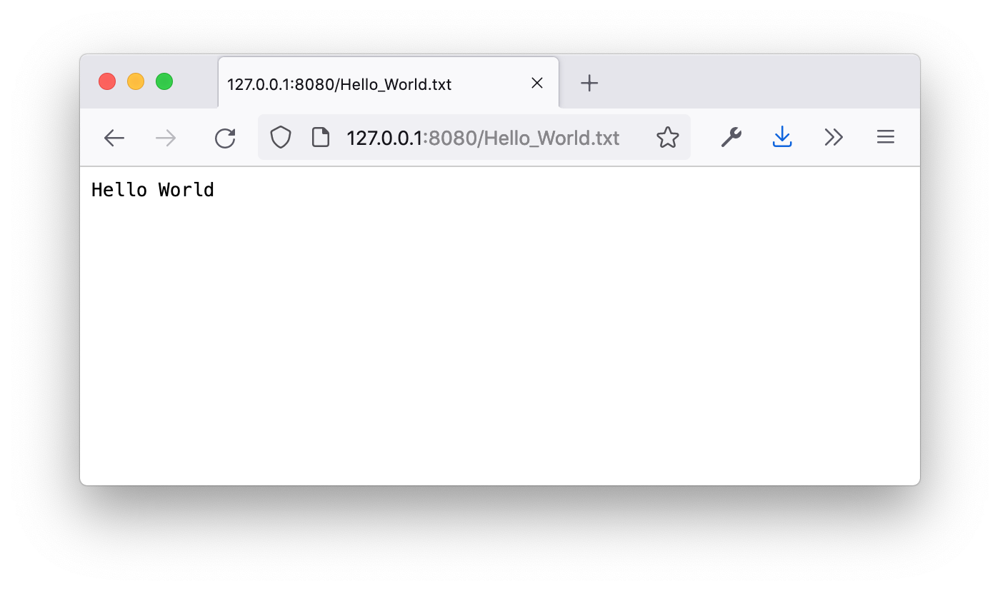
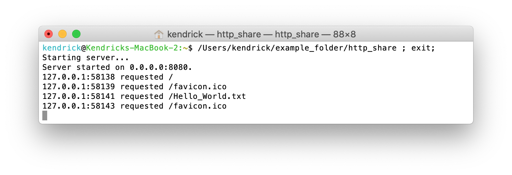
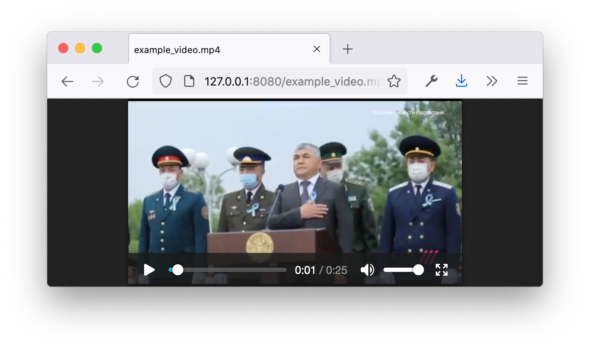
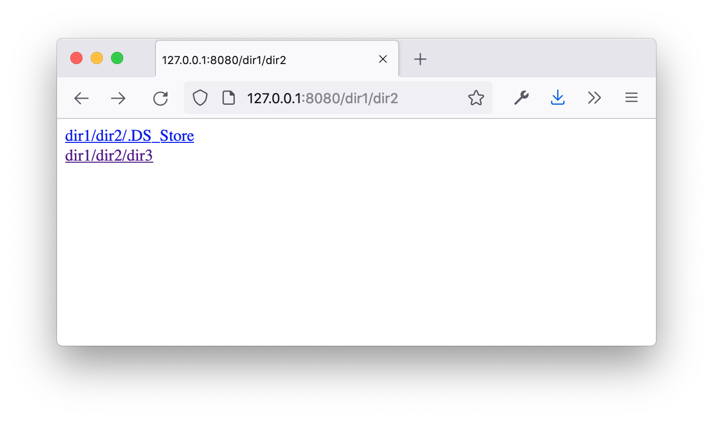

# http-share
**A little Rust app that shares the files of the folder it's put in via HTTP (on port 8080).**

A folder with some files and the *http_share* binary:

All files (and sub-folders) in a directory are listed as clickable links:

Viewing a text file:

All HTTP requests are logged to console:

Viewing a video file is possible too:

And sub-directories work too, of course:

## ToDo's

* Add support for *HTTP basic access authentication* using an `.htaccess`/`.htpasswd` file (or similar) and/or command line arguments and/or a simple password prompt in the terminal after starting the binary.
* **Maybe** prettify the HTML <table> borders.
* **Maybe** beautify the terminal logging with colors.
* Update this README to the newest version (screenshots).