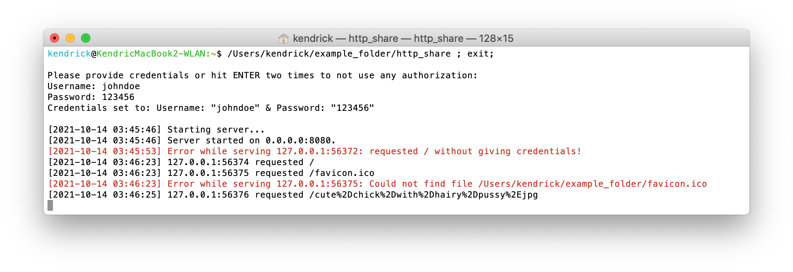

# http-share
**A Rust app that shares the files of the folder it's put in via HTTP (on port 8080).**

## Features

* Memory-efficient video streaming (thanks to contributor [linuskmr](https://github.com/linuskmr)).
* Protect the server with a custom username and password (HTTP Basic Authentication).
* View the files in a folder in 3 different views/layouts: a basic *List View*, *Table View* (sortable columns!) and *Grid View* (pictures shown, thumbnails for videos).
* *ffmpeg*-generated thumbnails for .mp4 files in *Grid View*.
* All (HTTP) requests, wrong password attempts and errors are logged to console with timestamp and IP address (the latter two in red color for emphasis).
* Unicode/UTF-8 support for file/folder names.
* Tested on iOS (support for HTTP range requests).

## Installation

0. If you haven't installed *Rust* / *rustup* yet, go to [https://www.rust-lang.org/tools/install](https://www.rust-lang.org/tools/install) and follow the instructions for your operating system. 
1. `rustup update`
2. `cargo install --git https://github.com/k-gruenberg/http-share`

## Screenshots

A folder with some files and the *http_share* binary:

The terminal output of the started *http_share* binary: all HTTP requests are logged to console with timestamp and IP address:

List View (default):

Table View:

Sorting by a column in Table View, e.g. ascending by size:

Grid View:

Viewing a text file:

Playing a video file:

Subfolders work too, of course, the current location/directory is shown at the very top:

HTTP Basic Authentication:

